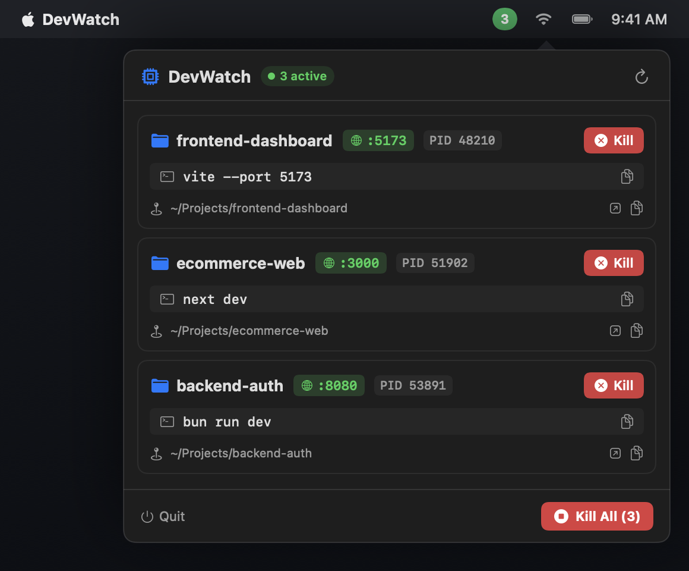

<div align="center">

# ⏱️ DevWatch

**The lightweight, native macOS menu bar monitor for your local development servers.**

[](https://apple.com)
[](https://swift.org)
[-brightgreen?style=flat-square)](Package.swift)
[](LICENSE)

<br/>



</div>

---

## 💡 Why DevWatch?

Every developer knows the pain: you have multiple terminal tabs, IDE windows, and background processes running. Suddenly, port `3000` or `5173` is already in use, a rogue Node or Bun server is quietly eating battery, or you can't remember which folder is hosting which localhost port.

**DevWatch** lives discreetly in your macOS menu bar. It continuously identifies your active Node, Bun, and Deno dev servers, maps them to their project folders and listening ports, and lets you open or terminate them with a single click.

---

## ✨ Features

- 🟢 **Dynamic Menu Bar Counter**:
  - Displays the live number of active dev servers directly in the menu bar.
  - Subtly muted when idle (`0`), turns into a vibrant emerald green pill badge when servers are running.
- 🎯 **Instant Localhost Access**:
  - Displays listening ports (e.g. `:5173`, `:3000`, `:8080`).
  - Click any port badge to open `http://localhost:<PORT>` directly in your default browser.
- 📁 **Smart Folder & Command Identification**:
  - Identifies the exact project folder name and relative project path (`~/Projects/...`).
  - Cleans up cluttered command lines (e.g. translates complex runtime paths into clean commands like `vite --port 5173`, `next dev`, `bun run dev`).
  - One-click copy buttons for both the command line and directory path.
  - "Reveal in Finder" button to jump straight to the project directory.
- 🛑 **One-Click Process Termination**:
  - **Individual Kill**: Cleanly terminates a specific dev server and all of its associated child processes (`SIGTERM` → `SIGKILL`).
  - **Kill All**: One button to terminate all running dev servers at once when switching tasks or wrapping up for the day.
- ⚡ **Lightweight & Blazing Fast**:
  - Built 100% in pure Swift with AppKit and SwiftUI.
  - Zero third-party dependencies, zero Electron overhead.
  - Consumes < 20 MB RAM and negligible CPU with non-blocking 2-second background polling.
- 🎨 **Native macOS Design**:
  - Supports both macOS Dark and Light modes with native vibrancy and styling.

---

## 🚀 Getting Started

### Prerequisites

- macOS 13.0 (Ventura) or later
- Swift 5.9+ / Xcode Command Line Tools (for building from source)

### Quick Run

Clone the repository and run:

```bash
git clone https://github.com/martinhjartmyr/dev-watch.git
cd dev-watch
make run
```

DevWatch will compile and launch directly into your macOS menu bar!

---

## 🛠️ Build & Development Commands

A convenient `Makefile` is provided:

| Command | Action |
|---|---|
| `make run` | Builds the app in release mode and launches it into the menu bar |
| `make build` | Compiles release binary and packages `build/DevWatch.app` |
| `make stop` | Stops any currently running `DevWatch` process |
| `make clean` | Cleans `.build/` and `build/` output directories |
| `swift test` | Runs the test suite and regenerates asset previews |

---

## 🔍 How Detection Works

DevWatch uses low-overhead system and kernel queries to detect dev servers without impacting system performance:

1. **TCP Socket Inspection**: Queries listening TCP ports via `/usr/sbin/lsof -nP -iTCP -sTCP:LISTEN` (~15ms execution time).
2. **Process Ecosystem Matching**: Matches processes from Node.js, Bun, Deno, Vite, Next.js, Astro, Remix, Nuxt, Nodemon, and package managers (`pnpm`, `npm`, `yarn`).
3. **Kernel CWD Resolution**: Resolves exact working directories using Darwin's high-performance `proc_pidinfo(..., PROC_PIDVNODEPATHINFO, ...)` kernel API.
4. **App Exclusion Heuristics**: Automatically ignores Electron desktop apps (Discord, Slack, Spotify, Raycast, VS Code extension helpers).
5. **Process Tree Deduplication**: Merges parent runners (e.g. `npm run dev`) with spawned child node servers so they display as a single unified card and terminate together cleanly.

---

## 📂 Project Structure

```
dev-watch/
├── Package.swift                    # Swift Package definition (Swift 6 ready)
├── Makefile                         # make run / build / stop / clean
├── LICENSE                          # MIT License
├── README.md                        # Documentation and overview
├── assets/
│   └── screenshot.png               # High-resolution Retina UI screenshot
├── Sources/
│   ├── DevWatchCore/
│   │   ├── Models/
│   │   │   └── DevServer.swift      # DevServer model, path & command formatting
│   │   ├── Services/
│   │   │   └── ProcessManager.swift # Process detection, lsof TCP sockets, Darwin C APIs, termination
│   │   ├── UI/
│   │   │   └── StatusBarController.swift # NSStatusItem, dynamic badge image, NSPopover
│   │   ├── Views/
│   │   │   ├── PopoverContentView.swift # Main SwiftUI popover view
│   │   │   ├── ServerCardView.swift     # Server card with port, folder, copy & kill
│   │   │   ├── HeaderView.swift         # Title, active count pill, refresh button
│   │   │   ├── FooterView.swift         # Kill All & Quit controls
│   │   │   └── EmptyStateView.swift     # Empty state when idle
│   │   └── AppDelegate.swift        # AppKit lifecycle & status item setup
│   └── DevWatch/
│       └── main.swift               # Accessory menu-bar app entrypoint (no Dock icon)
├── Tests/
│   └── DevWatchTests/
│       └── DevWatchTests.swift      # Unit tests & screenshot generator
└── scripts/
    ├── build.sh                     # Packages release binary into DevWatch.app
    ├── run.sh                       # Builds (if needed) and launches DevWatch
    └── kill.sh                      # Terminates DevWatch process
```

---

## 🤝 Contributing

Contributions, bug reports, and feature requests are welcome!

1. Fork the repository
2. Create your feature branch (`git checkout -b feature/amazing-feature`)
3. Commit your changes (`git commit -m 'Add some amazing feature'`)
4. Push to the branch (`git push origin feature/amazing-feature`)
5. Open a Pull Request

---

## 📄 License

This project is licensed under the MIT License - see the [LICENSE](LICENSE) file for details.
